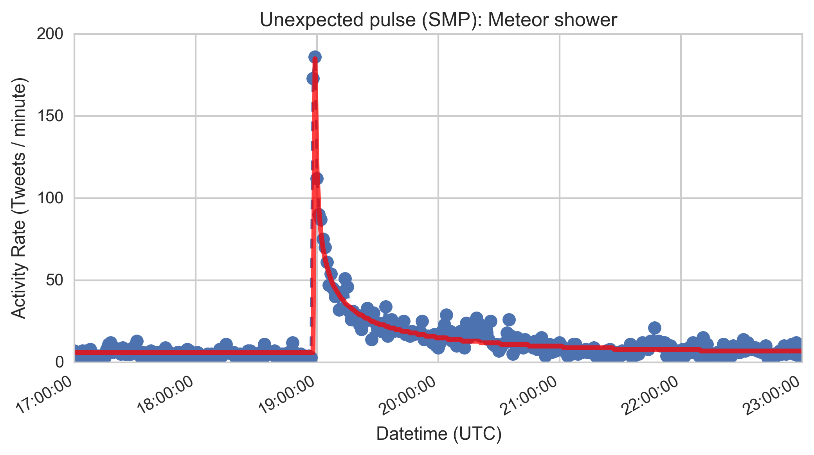

# The Social Media Pulse 

Document (PDF and TeX source) and associated Python source code for modeling [the Social Media Pulse](doc/pulse.pdf), a statistical model that describes observed Tweet activity volume in the period after a large number of people witness a sudden, unexpected event. An accompanying blog post on the paper and model can be found [here](TBD). 



## White Paper 

The [PDF document](doc/pulse.pdf) was generated on OS X with ``pdflatex`` and ``BibTeX``. The easiest way to install the MacTeX distribution is through the binary download procedure at [tug.org](https://tug.org/mactex/). 

This document falls under the [Creative Commons License (CC BY 4.0)](https://creativecommons.org/licenses/by/4.0/).

### Usage 

To compile a new version of the document, navigate to the ``doc`` directory (where the main ``.tex`` and ``.bib`` files are located) and run: 

```
[doc] $ pdflatex pulse.tex; bibtex pulse.aux; pdflatex pulse.tex; pdflatex pulse.tex
``` 

The ``LaTeX`` compilation is very verbose.


## Code 

The Python utility should work with versions >=2.7. Its dependencies are ``numpy >= 1.10`` and ``scipy >= 0.17``, both of which are available through your favorite package manager e.g. [pip](https://pip.pypa.io/en/stable/) or distribution e.g. [Anaconda](https://docs.continuum.io/anaconda/index). 

This code falls under the [Apache 2.0 license](http://www.apache.org/licenses/LICENSE-2.0).
 
### Usage 

The main fitting utility ``smp.py`` is primarily used from the command line, though is also capable of being imported. For a list of the available options, run with the ``-h`` flag. Additional command-line flags are used to modify the behavior of the model, including initializing parameters, and specifiying non-standard positions for data columns. 

Data can be read from the shell ``stdin`` or from a file (by way of a passed filepath). For example, the following command will fit the included test data to the SMP model, writing the input and corresponding fit data to ``fit-data.csv`` and the summary fit parameters to ``fit-results.txt``:

```
[src] $ cat test.csv | python smp.py > fit-data.csv 2> fit-results.txt
``` 

For fast iteration, the output of ``smp.py`` also plays nicely with [``pandashells``](https://github.com/robdmc/pandashells) for inspection of model fit, and modifications to e.g. the fitting window, or adjustments to parameter initialization. For example, the following command will generate a figure showing the converged (scaled) fit on the test data (assuming ``pandashells`` and its dependencies are properly installed):

```
[src] $ cat test.csv | python smp.py | p.plot -x scaled_x -y scaled_y scaled_fit 
```

